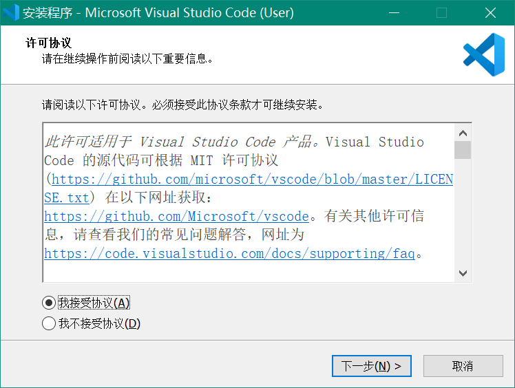
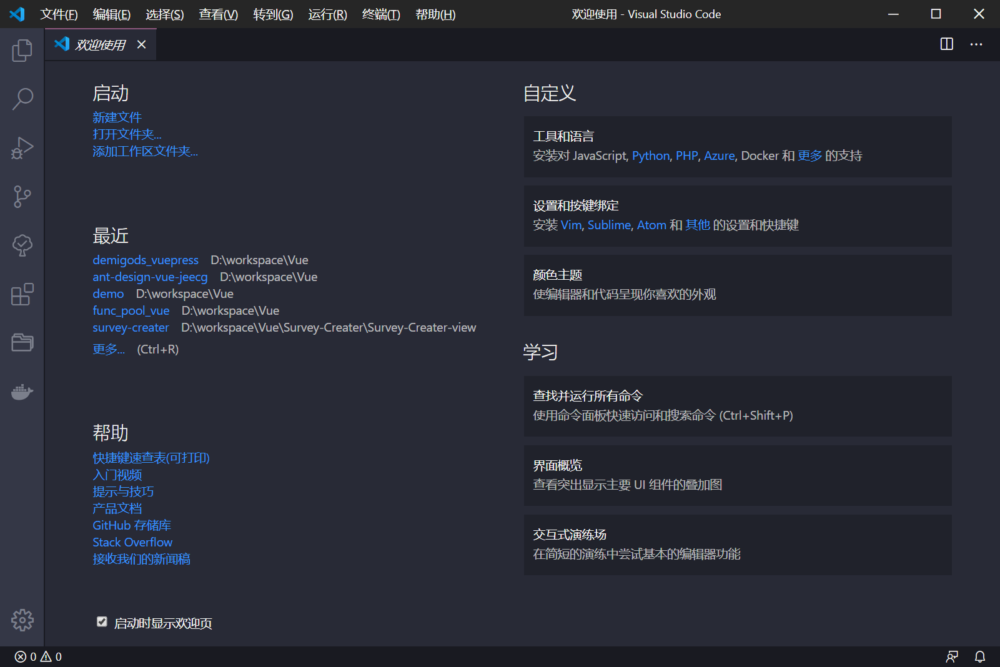
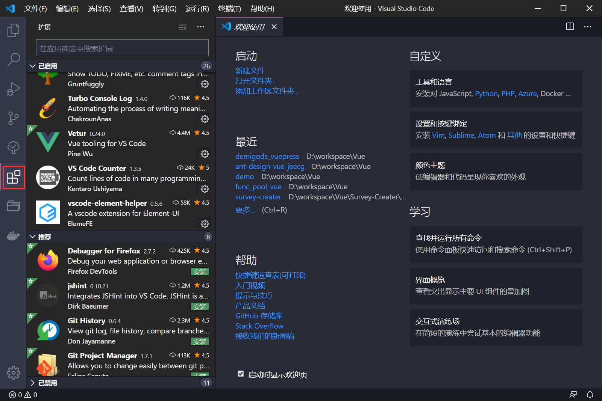

## 开发环境
vue的开发基于node运行，所以需要安装node环境，vue-cli作为vue运行环境也是要安装的。

### node
> [node下载地址](https://nodejs.org/en/)

选择适合当前系统的版本进行安装。


安装期间直接下一步就可以。


安装完成后验证node和npm安装情况。
```sh
node -v

npm -v
```

返回正确的版本号，说明安装成功。

### vue-cli
> [vue-cli 3.0 安装说明](https://cli.vuejs.org/zh/guide/installation.html)

运行以下命令安装`@vue/cli`
```sh
npm install -g @vue/cli
```

安装完成后验证vue-cli安装情况。
```sh
vue -V
```

返回正确的版本号，说明安装成功。

## IDE

前端开发工具有很多，主流有vscode、webstrom、hbuilder等。
本文主要使用vscode这款开发工具。

### vscode

首先下载vscode安装包。
> [vscode 下载地址](https://code.visualstudio.com/)


安装vscode，安装期间直接下一步就可以。


软件界面


在扩展中心安装插件


需要安装的插件

* Chinese (Simplified) Language Pack for Visual Studio Code
* Vetur