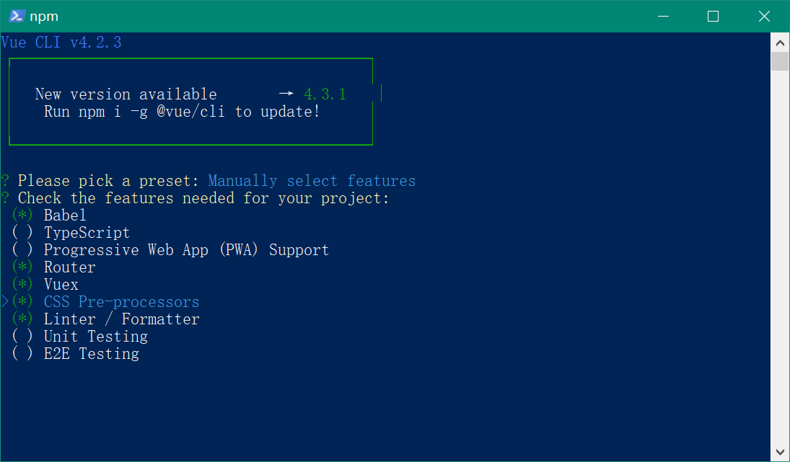
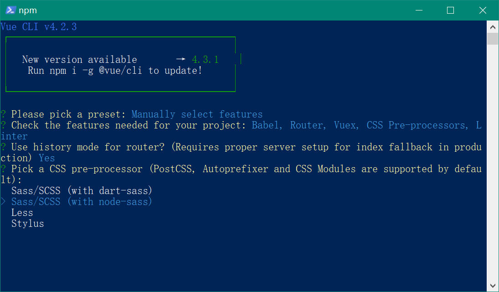
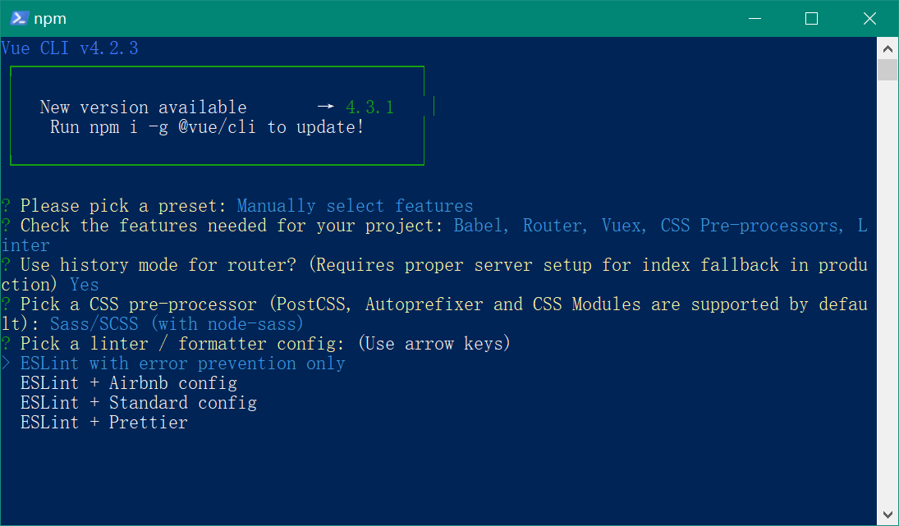
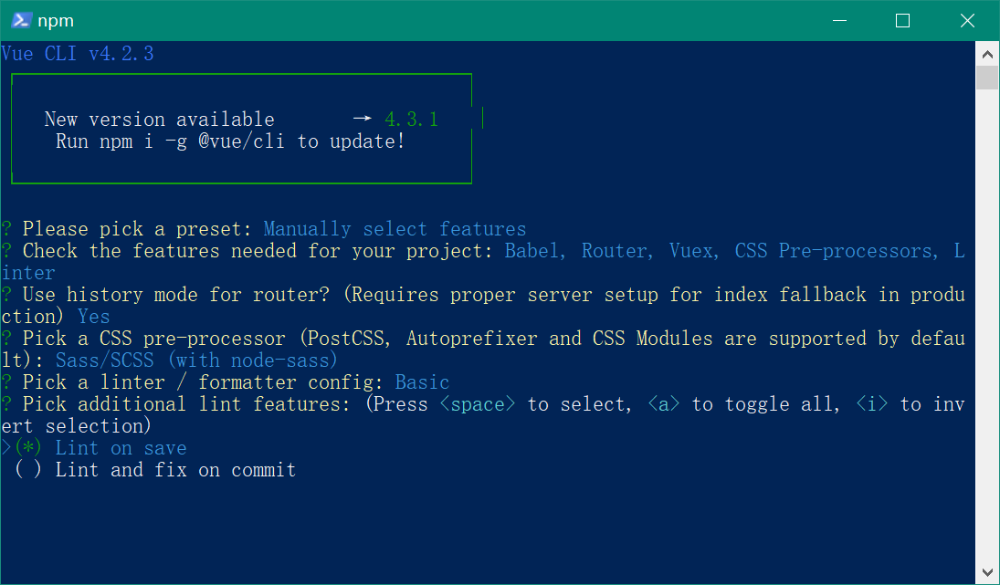
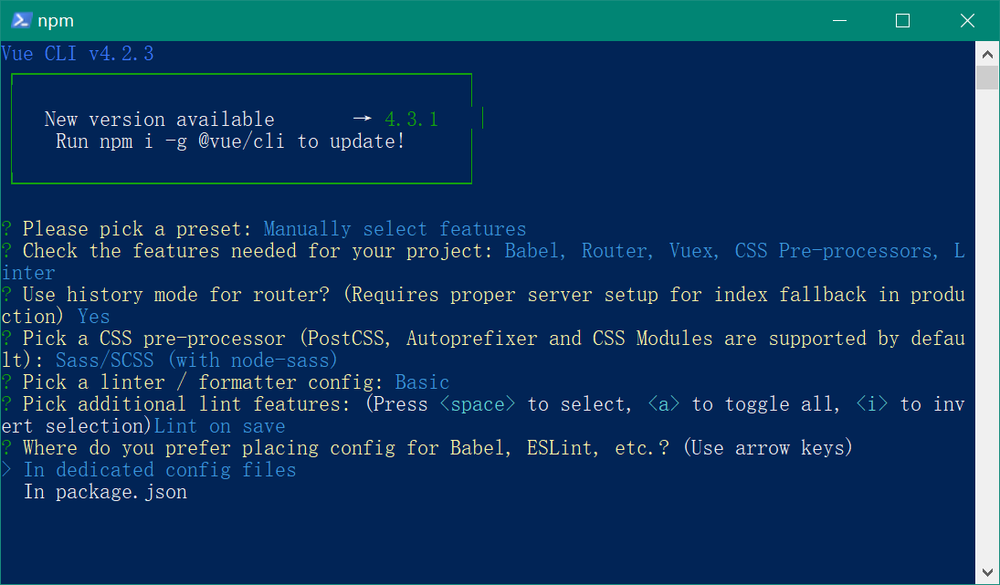
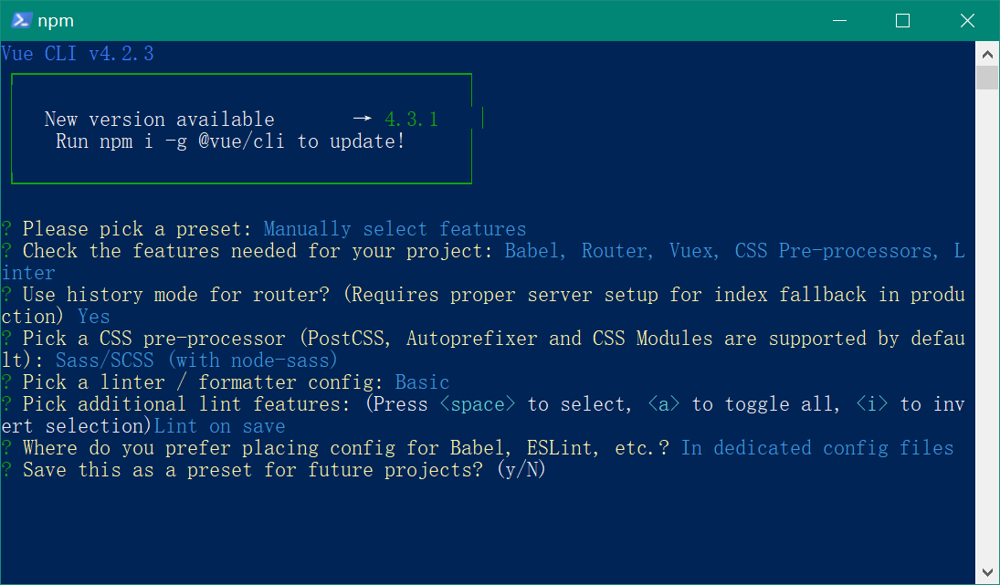
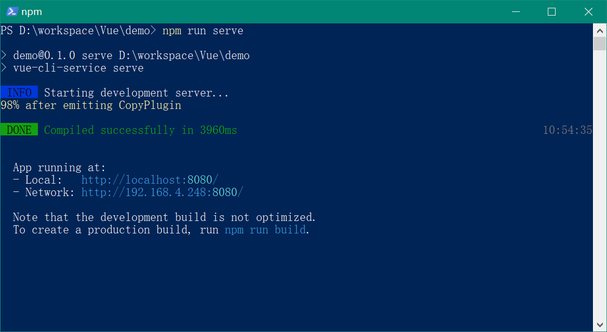

## 使用vue-cli创建项目

> [官方文档](https://cli.vuejs.org/zh/guide/installation.html)

运行 `vue create`命令创建一个vue项目。

```sh
vue create <name>
```

之后会提示你选择创建项目的模板


默认配置`default`为`Babel + ESLint`，该模板适合原型和小项目试验。

实际项目开发请手动选择特性`Manually select features`。

使用【空格键】选择要使用的特性，【回车】下一步。



路由是否使用`history`模式。


选择预处理css的语言`Sass/SCSS (with node-sass)`。



选择eslint配置`ESLint with error prevention only`。



代码风格检查，选择`Lint on save`在保存时检查。



babel和eslint是否生成独立的配置文件，选择`In dedicated config files`生成独立的配置文件。



是否要保存为一个初始化模板。



创建项目成功，之后会自动安装依赖。


## vue项目说明

### 目录

```javascript
│  .browserslistrc					// 浏览器兼容配置
│  .eslintrc.js						// eslint配置
│  .gitignore						// git忽略配置
│  babel.config.js					// babel配置
│  package-lock.json				// 本地包锁定
│  package.json						// node项目配置
│  README.md						// 自述文档
│  
├─node_modules						// 本地npm包
│
├─public							// 打包目录
│      favicon.ico
│      index.html
│      
└─src								// 源码
    │  App.vue						// 根组件
    │  main.js						// 项目入口
    │  
    ├─assets						// 资源
    │      logo.png
    │      
    ├─components					// 组件
    │      HelloWorld.vue
    │      
    ├─router						// 路由
    │      index.js					
    │      
    ├─store							// vuex
    │      index.js
    │      
    └─views							// 页面
            About.vue
            Home.vue
```

### 项目运行和打包

在项目目录运行`npm run serve` 可以启动项目。


在项目目录运行`npm run build` 可以打包项目。


上述命令对应`package.json`中`script`部分。

```json
"scripts": {
  "serve": "vue-cli-service serve",
  "build": "vue-cli-service build",
  "lint": "vue-cli-service lint"
}
```